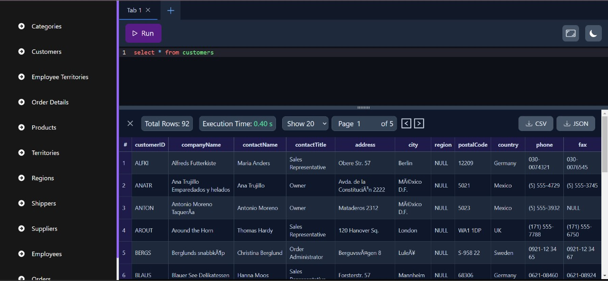
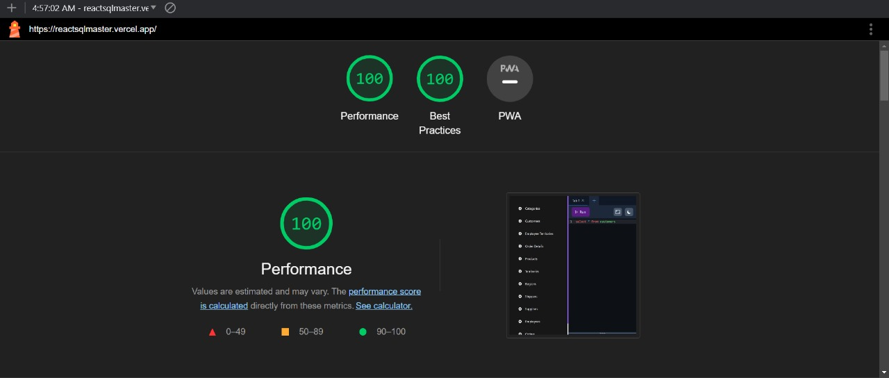
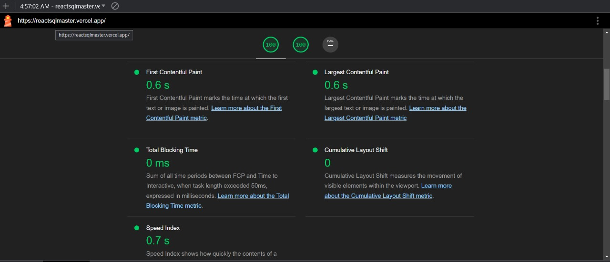

# 🚀👨‍💻 ReactSqlMaster

## ⚡Enhancing Your SQL Query Management Web Application for an Exceptional User Experience
## ⚡Powered by `React`, `Redux Toolkit`, and `TailwindCSS`
ReactSqlMaster is an advanced tool meticulously crafted for data analysts, enabling them to seamlessly execute and manage SQL queries. It presents an intuitive interface, empowering users to run queries, visualize results in a tabular format, and save frequently used queries for future reference.

## 👨‍💻 Demo

Try out the website : [ReactSqlMaster](https://reactsqlmaster.vercel.app/)

## 👨‍🔧 Tech Stack

## 👨‍💻 Features

:white_check_mark: **Efficient GitHub Data Retrieval**\
Our app swiftly fetches CSV data from GitHub, offering you the latest information without storing it locally. Enjoy real-time data access and enhanced security.

:white_check_mark: **SQL Query Execution in Editor**

1. Users can seamlessly execute SQL queries using our editor.
2. We provide predefined queries for convenience:
   
   - `select * from customers`
   - `select * from categories`
   - `select * from employee_territories`
   - `select * from order_details`
   - `select * from orders`
   - `select * from products`
   - `select * from regions`
   - `select * from shippers`
   - `select * from suppliers`
   - `select * from territories`

:white_check_mark: **Code Editor Tabs**\
Our application utilizes a tab-based system for managing multiple SQL queries effortlessly. Each tab serves as a dedicated workspace, housing a query editor and displaying results.

*Note:* To ensure optimal performance, we limit the number of tabs to 15. This restriction prevents clutter and maintains a user-friendly experience, with timely notifications when the limit is reached.

:white_check_mark: **Dark Mode and Theme Persistence**\
Customize your experience with the flexibility to switch between Dark Mode and Light Mode. Your chosen theme is intelligently saved in Local Storage, ensuring your preferred mode is maintained across sessions. Enjoy a visually tailored environment that suits your preference every time you return.

:white_check_mark: **Full-Screen Editor Mode**\
Experience a distraction-free workspace by effortlessly switching to a full-screen view of the editor with a single click.

:white_check_mark: **Split View for Enhanced Productivity**\
Elevate your workflow with the dynamic split view feature. Seamlessly examine your SQL code in the Code Editor alongside real-time query results. This intuitive split window allows you to effortlessly drag the divider vertically, adapting the view to your precise needs. Experience unparalleled convenience as you edit and observe outcomes in a synchronized manner, boosting your productivity.

:white_check_mark: **Query Execution Time Insight**\
Gain valuable insights into query performance with our execution time feature. Track the precise duration it takes for your SQL query to run and fetch results. This real-time feedback empowers you to optimize and fine-tune your queries for efficiency and speed. Stay in control of your data analysis process by monitoring execution times at a glance.

:white_check_mark: **Comprehensive Table Schema Insights**\
Explore the details of your tables effortlessly. Our user-friendly interface provides you with comprehensive information about your data, including the total number of rows, the option to specify rows per page for easy navigation, and a clear view of table headers. This intuitive table schema view equips you with the insights you need to effectively analyze and manipulate your data, enhancing your data analysis experience.

:white_check_mark: **Informative Toast Notifications**\
Stay informed at every step of your query execution. Our application keeps you in the loop with informative toast notifications. Whether your query runs successfully or encounters an error, you'll receive timely and clear notifications, ensuring that you're always aware of the status of your queries. These toast notifications are designed to enhance your user experience, providing valuable feedback and keeping you updated on the progress of your tasks.

:white_check_mark: **Export Data in CSV or JSON Format**\
Empower yourself with the ability to export query results effortlessly. Our application offers a convenient feature that allows you to download your query results in either CSV or JSON format, providing flexibility and compatibility with various data processing tools. Whether you need to share your data with colleagues or import it into other applications, you can easily do so with just a few clicks. This feature enhances your data management capabilities and streamlines your workflow.

## ⏱ Page Load Time

The page load time for this website on desktop ranges from 0.4 seconds to 0.6 seconds.

I calculated the performance and load time of this website using two tools: Lighthouse Chrome DevTools and BrowserStack SpeedLab.

## 🚀Lighthouse Chrome Report (got a perfect 💯)

- **First Contentful Paint** marks the time at which the first text or image is painted
- **Time to interactive** is the amount of time it takes for the page to become fully interactive.
- **Speed Index** shows how quickly the contents of a page are visibly populated.
- **Total Blocking Time** is the sum of all time periods between FCP and Time to Interactive, when task length exceeded 50ms, expressed in milliseconds.
- **Largest Contentful Paint** marks the time at which the largest text or image is painted.
- **Cumulative Layout Shift** measures the movement of visible elements within the viewport.

## 🪜 Steps I took to optimize the page load time

- Used code-splitting with `React.Lazy()` and `Suspense` to lazy load the components and split javaScript into multiple chunks using Dynamic runtime Imports for faster page load.
- Used `React.Memo()` to optimize the render performance of functional components.
- Used Lighthouse DevTools Extension to find the performance issues and fix them using their actionable suggestion.
- Used vercel to deploy this website to leverage its Vercel Edge Network compression that results in the better performance.

## Available Scripts

In the project directory, you can run:

### `npm run dev`

Runs the app in the development mode.\
Open [http://localhost:5173](http://localhost:5173) to view it in the browser.

The page will reload if you make edits.\
You will also see any lint errors in the console.
